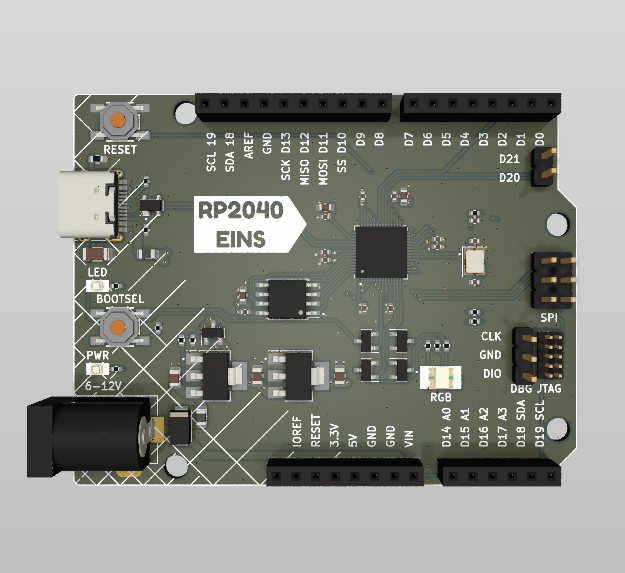
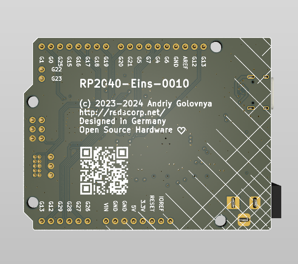
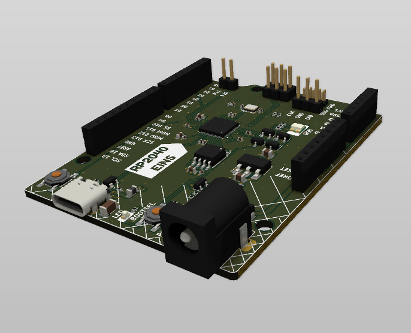
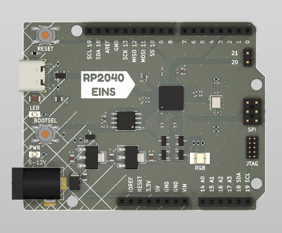

```
 ______    _______  _______  _______  _   ___  _______         _______  ___   __    _  _______ 
|    _ |  |       ||       ||  _    || | |   ||  _    |       |       ||   | |  |  | ||       |
|   | ||  |    _  ||____   || | |   || |_|   || | |   | ____  |    ___||   | |   |_| ||  _____|
|   |_||_ |   |_| | ____|  || | |   ||       || | |   ||____| |   |___ |   | |       || |_____ 
|    __  ||    ___|| ______|| |_|   ||___    || |_|   |       |    ___||   | |  _    ||_____  |
|   |  | ||   |    | |_____ |       |    |   ||       |       |   |___ |   | | | |   | _____| |
|___|  |_||___|    |_______||_______|    |___||_______|       |_______||___| |_|  |__||_______|
```

# RP2040-Eins Project

The **RP2040-Eins** project aims to create a replacement for the Arduino UNO R3 or Arduino M0 using the RP2040 MCU.

## RP2040-Eins Board

The **RP2040-Eins** board is a 4-layer design intended to accommodate the popular Raspberry Pi RP2040 MCU within the standard Arduino UNO R3 footprint.

This board is crafted in Germany, and its name, "RP2040-Eins", incorporates the German word "Eins" (pronounced as "eye-ns"), which translates to "one". This name choice reflects the use of the same form-factor as the Arduino "Uno", which means "one" in Italian.

Preview:





You can view the [Schematics in PDF format](doc/RP2040-Eins.pdf) for detailed information.

STEP 3D file is available [with pins](doc/RP2040-Eins.step).

Features:

- Arduino UNO compatible pinout
- Partially compatible with Arduino Nano RP2040 Connect pinout
- Dual-core Cortex-M0+ Raspberry Pi RP2040
- 21 GPIO pins, including 4 analog inputs
- USB Type-C connector
- JTAG debugging connector
- LDO-based 5V and 3.3V power supply with a maximum 12V input
- Supports both SOIC and WSON 16MB flash packages
- Includes power, user and RGB LEDs

CAM files, as well as the BOM and CPL files for JLCPCB, are available.

## Version History

### v1.0b3



Third testing release.

- Moved BOOTSEL button to the edge of the board for easier access when shield is attached.
- Moved QSPI flash closer to the MCU.
- Added Arduino code examples for RGB LED.
- Rearranged routing of several lines.
- Added fancy board name label.
- Added white silkscreen under the LEDs to add light reflection.
- Moved text on the back of the board a bit.

### v1.0b2


Second testing release.

- Added MOSFETs for RGB LED to make it work similarly to user LED.
- Moved few components around.
- Added QR code to the back of the board.

### v1.0b1


Initial release for testing purposes.

## Code Examples

Following code examples are available:

- ``src/arduino/rgb_led/rotation_blink.ino`` - blinks RGB LED in rotation individually
- ``src/arduino/rgb_led/rotation_fade.ino`` - fades RGB LED in rotation individually
- ``src/arduino/rgb_led/rotation_fade2.ino`` - fades RGB LED in rotation from one color to another

Please use latest official version of [earlephilhower/arduino-pico](https://github.com/earlephilhower/arduino-pico) and select "RP2040-Eins" board as a target.

## Links

- [Raspberry Pi RP2040 information page](https://www.raspberrypi.com/documentation/microcontrollers/rp2040.html).
- [Arduino UNO R3 information page](https://docs.arduino.cc/retired/boards/arduino-uno-rev3-with-long-pins).
- [Arduino SDK for RP2040 board](https://github.com/earlephilhower/arduino-pico).

## How to Help

Your contributions as code, resources, or finances are welcome! Please contact me directly via email at andriy.golovnya@gmail.com or through my [GitHub profile](https://github.com/red-scorp).

If you'd like to make a financial contribution, you can donate via [PayPal](http://paypal.me/redscorp) or [Ko-Fi](http://ko-fi.com/redscorp). Your support is greatly appreciated.

Thanks in advance!